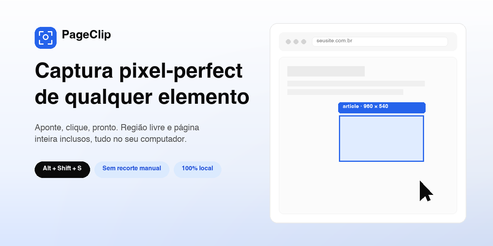

# PageClip

🇧🇷 [Português](README.md) · 🇺🇸 **English**

[](https://github.com/lucasfdigital/PageClip/stargazers)
[](https://github.com/lucasfdigital/PageClip/network/members)
[](https://github.com/lucasfdigital/PageClip/commits/main)
[](LICENSE)
[](https://github.com/lucasfdigital/PageClip/issues)
[](https://github.com/lucasfdigital/PageClip/pulls)

An MV3 extension (Chrome/Edge) for taking screenshots **cropped exactly to a DOM element**.
You hover, the extension highlights the element under the cursor, you click, and you get a PNG of
exactly that piece of the page, with no manual cropping.

You can also capture a **free region** or the **full page**, and the target can be **larger than
the screen**: in that case the extension scrolls the page in steps and stitches the shots together.

---

## Install

**Easiest way:** download the `.zip` from the [latest release](https://github.com/lucasfdigital/PageClip/releases/latest), unzip it and follow the steps below, picking the unzipped folder.

1. Open `chrome://extensions` (or `edge://extensions`).
2. Turn on **Developer mode**.
3. Click **Load unpacked** and pick this folder (or the folder from the `.zip`).

The content script and the service worker need no build, bundler or `npm install`,
it's plain ES module JavaScript. Requires Chrome/Edge 116 or newer.

The hub page (gallery/settings/help) is the exception: it's React + BoardUI and lives in
`hub-react/` (Vite + Tailwind v4). After changing it, generate the files used by the
extension with:

```
cd hub-react
npm install   # first time only
npm run build # writes to src/hub-boardui/
```

Then reload the extension in `chrome://extensions`. The old files in `src/hub/` are kept
as reference, but what actually opens is the generated `src/hub-boardui/index.html`.

## Use

| Action | How |
| --- | --- |
| Open selection mode | toolbar icon, `Alt+Shift+S`, or right click → *Capture element…* |
| Capture the full page right away | `Alt+Shift+F` |
| Switch mode | `1` element · `2` region · `3` page |
| Walk the DOM tree | `↑` parent · `↓` child · `←` `→` siblings |
| Lock the selection | `Space` (the highlight turns dashed and stops following the mouse) |
| Capture | click, or `Enter` |
| Open the options panel | `›` button on the bar or on the result popup |
| Stop a long capture | **Stop** button, or `Esc` |
| Exit | `Esc` or right click |

Navigating with the arrow keys **pins** the target, otherwise the slightest mouse jitter would
undo the climb you just made. The pin releases on its own as soon as the mouse moves on purpose
(more than 10px). If you want a real lock, to move the cursor to the panel without losing the
target, use `Space`; then only `Space` releases it.

### Full page

Before capturing, **scroll the page to the bottom**. The shot only sees what has already been
rendered, so lazy-loaded content that never showed up won't be in the image. The extension
reminds you of this on screen whenever you enter page mode.

Once the capture starts, the progress bar shows how many screens are left and has a
**Stop (Esc)** button. Stopping doesn't lose the work: the image is cropped exactly to what
had already been shot.

### The popup and the side panel

When you capture, a **small popup** shows up in the bottom right corner with the preview, the
file name, the dimensions and the actions: Download, Copy, Copy CSS selector and Capture another.

The `›` arrow, found both on the popup and on the capture mode bar, opens the **side panel**,
docked on the right, with the settings that change from capture to capture (format,
resolution, padding, what to do on capture) and thumbnails of recent captures. Clicking a
thumbnail brings that image back to the popup, ready to download or copy.

With the panel open, the bar and the popup slide to the left instead of being covered.
When closed, the panel takes no pointer events: the right strip still belongs to the page,
and clicking there clicks the site.

The breadcrumb in the bottom left corner shows the ancestors of the highlighted element, and
clicking one selects that level. It's the fastest way to grab "the whole card" instead of the
text under the cursor.

Everything you capture goes to the extension's gallery (⚙ icon on the selection mode bar),
where you can download, copy, reopen and delete. Settings live on the same page.

---

## How it works

The browser only lets an extension shoot **the visible part of the tab** (`captureVisibleTab`).
Everything else is the extension's job:

**Crop.** We measure the element with `getBoundingClientRect()`, take the shot and crop using the
image's real scale (`shot width ÷ viewport width`). That division is what makes the crop match
pixel for pixel with browser zoom and HiDPI screens, and it uses
`documentElement.clientWidth`, not `window.innerWidth`, because the shot doesn't include the
scrollbar and `innerWidth` does.

**Stitching.** When the target doesn't fit on screen, we scroll piece by piece. After **every**
scroll the target is measured again and only the part that's really visible is drawn into the final
image. Since nothing is extrapolated from the starting position, there's no accumulated error: at
most a piece the browser refused to show is left out, and that becomes a warning in the panel
instead of a crooked image. `fixed`/`sticky` elements that aren't part of the target are hidden
while scrolling so they don't repeat in every strip.

**Containers with their own scroll.** The same loop works by scrolling an inner `<div>` instead of
the page, so you can capture a whole table inside a panel with `overflow: auto`.

**Interface.** Highlight, bar, breadcrumb and result panel live in a single *closed shadow root*
attached to `<html>`. The page's CSS can't reach any of it and ours doesn't leak. Only the parts
that are actually clickable get `pointer-events`, so the extension never steals clicks from areas
with no interface.

**Permissions.** There are no `host_permissions`. The extension gets access to the tab only at the
moment you trigger the icon, the shortcut or the context menu (`activeTab`), and loses that access
when the page navigates. Nothing leaves your machine: captures stay in local IndexedDB and settings
in `storage.sync`.

## File map

```
manifest.json
src/
  background/service-worker.js   triggers, on-demand injection, captureVisibleTab, gallery
  content/
    boot.js                      classic script that loads the main ES module
    main.js                      controller: events, keyboard, orchestration
    overlay.js                   interface in the shadow root
    styles.js                    overlay CSS
    picker.js                    hit-test (with shadow DOM) and tree navigation
    capture.js                   shot, crop, stitching, canvas limits
  shared/
    protocol.js                  message contract between contexts
    settings.js                  preferences + normalization
    db.js                        gallery in IndexedDB
    format.js                    file names, dates, sizes
  hub/                           old plain JS hub (reference; no longer opens)
  hub-boardui/                   current hub, generated by the hub-react build (don't edit by hand)
  hub-react/                     hub source: React 19 + Tailwind v4 + BoardUI
icons/
```

```
hub-react/
  src/App.jsx                    brand, tab navigation and panels
  src/hub/Gallery.jsx            gallery (BoardUI: Button, Input, Badge, Kbd)
  src/hub/SettingsForm.jsx       settings (BoardUI: Select, Slider, Switch, Input)
  src/hub/HelpPanel.jsx          help (BoardUI: Kbd)
  src/components/                BoardUI components (`npx boardui add <name>`)
  src/styles/                    BoardUI theme, typography and global styles
```

The "is this tab in selection mode?" state is **not** kept in the service worker, since it can be
shut down at any moment and the answer would be wrong. Instead, the service worker asks the tab
(`PING`) before deciding whether to open or close the mode.

## Settings worth knowing

- **Resolution**, `Screen` outputs at physical density (sharper, bigger file); `1 CSS pixel = 1 pixel`
  outputs at logical size.
- **Delay between shots**, raise it if the site loads images as you scroll and they come out
  empty in the stitching.
- **Padding around the element**, breathing room in pixels; with PNG, padding that falls outside
  the page is transparent.
- **File name**, template with `{site}` `{tag}` `{mode}` `{date}` `{time}` `{w}` `{h}`.

## Known limitations

- You can't pick elements **inside a cross-origin iframe**, but you can select the whole
  `<iframe>`, and the image comes out right (the crop comes from the tab shot, not the inner DOM).
- Internal browser pages (`chrome://`, the extension store, the PDF viewer) block any
  extension. The icon flashes a `!` explaining it.
- The highlight doesn't trigger the page's `:hover`, so menus that only exist with the mouse over
  them must be opened first; lock the selection with `Space` so you don't lose the target.
- `captureVisibleTab` has a quota of a few calls per second. Stitched captures start fast and
  slow down on their own if Chrome complains, so a very long page takes a few seconds.
- **Infinite scroll** (YouTube, feeds): these pages declare a huge height and grow as you scroll,
  so "the full page" has no end. PageClip stops at 80 screens and warns you, and the final image
  is scaled down if it goes over 100 megapixels, otherwise the canvas alone would eat hundreds of
  MB of RAM. You can also hit **Stop** at any time: the image is cropped to what had already been
  shot, instead of being lost.
- The tab must stay in the foreground during capture. `captureVisibleTab` shoots the window's
  *visible* tab, so if you switch tabs in the middle of a stitch, the next shot would be of
  another page. The extension detects this and stops with a warning instead of stitching garbage.
- Content that changes size while scrolling (carousels, virtualized lists) may come out
  inconsistent; in that case a warning shows up in the panel.

## Packaging

For the Chrome Web Store / Edge Add-ons, just zip the contents of this folder (`manifest.json`
must be at the root of the zip), **excluding** `hub-react/` (`src`, `node_modules`, Vite
configs): the extension only uses the already generated `src/hub-boardui/`. For a local `.crx`,
use *Pack extension* in `chrome://extensions` and keep the generated `.pem`, it's what keeps
the same ID across versions.

## Contributing

PageClip is open source (MIT). Feel free to open issues and PRs, the flow is
described in [CONTRIBUTING.md](CONTRIBUTING.md#english).

---

<p align="center">Crafted by <a href="https://github.com/lucasfdigital">Lucas Fernandes</a></p>
